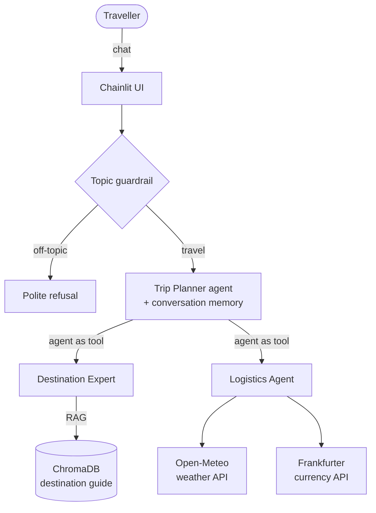

# ✈️ AI Travel Agent

A **multi-agent trip planner** built with the **OpenAI Agents SDK**. It suggests destinations from its own knowledge base (RAG), checks the **live weather**, converts your budget into the **local currency**, remembers your preferences during the chat, and politely refuses anything that isn't travel.

    

---

## What it can do

| Ask it… | What happens behind the scenes |
|---|---|
| *"Cheap city break in the Balkans in May with good food?"* | The **Destination Expert** searches the destination guide (RAG over ChromaDB) |
| *"Plan 3 days in Lisbon, I like viewpoints"* | The **Trip Planner** builds a day-by-day itinerary |
| *"Weather in Vienna for the next 5 days?"* | The **Logistics Agent** calls the Open-Meteo API (live data) |
| *"500 EUR in Hungarian forint?"* | The **Logistics Agent** calls the Frankfurter API (ECB rates) |
| *"…make it cheaper"* | **Memory**: it remembers your earlier budget, dates and style |
| *"Write my Python homework"* | The **guardrail** blocks off-topic requests |

## Architecture



**Agent capabilities used**

1. **Multi-agent orchestration**: a planner that delegates to two specialist agents (agents as tools)
2. **Tool calling**: typed Python function tools for weather and currency
3. **RAG**: semantic search over a 25-destination guide stored in ChromaDB
4. **Guardrails**: an input guardrail with a structured-output classifier keeps the agent on topic
5. **Memory**: each chat has its own SQLite session, so follow-up questions keep context

**Model-agnostic**: every agent runs through **LiteLLM**, so you can switch between Gemini, OpenAI, Claude or AWS Bedrock by changing one line in `.env`. The default is **Gemini 2.5 Flash on Google's free tier**.

## Quick start

**Fastest: GitHub Codespaces.** Click **Code → Codespaces → Create codespace on main**. Everything installs automatically. Then add your key to `.env` and run the last two commands below.

**On your own computer:**

```bash
git clone https://github.com/fazilebrahimi1/ai-travel-agent.git
cd ai-travel-agent

python -m venv .venv && source .venv/bin/activate    # Windows: .venv\Scripts\activate
pip install -r requirements.txt

cp .env.template .env        # then paste your key into .env
python scripts/build_knowledge_base.py               # embeds the destination guide
chainlit run app.py                                  # opens http://localhost:8000
```

Get a free Gemini API key at [Google AI Studio](https://aistudio.google.com/apikey).

**Use another model** by setting `MODEL` in `.env`:

| Provider | `MODEL` | Key |
|---|---|---|
| Google Gemini (default, free tier) | `litellm/gemini/gemini-2.5-flash` | `GEMINI_API_KEY` |
| OpenAI | `litellm/openai/gpt-4o-mini` | `OPENAI_API_KEY` |
| Anthropic | `litellm/anthropic/claude-3-5-haiku-latest` | `ANTHROPIC_API_KEY` |
| AWS Bedrock | `litellm/bedrock/eu.amazon.nova-lite-v1:0` | AWS credentials |

## Project structure

```
ai-travel-agent/
├── app.py                      # Chainlit chat UI: streaming, tool steps, starters
├── travel_agent/
│   ├── team.py                 # the three agents and how they connect
│   ├── tools.py                # function tools exposed to the agents
│   ├── services.py             # weather + currency API clients (testable, no LLM)
│   ├── knowledge.py            # ChromaDB build + semantic search (RAG)
│   ├── guardrails.py           # travel-topic input guardrail
│   └── config.py               # model + paths from environment variables
├── data/destinations.csv       # the destination guide (25 places)
├── scripts/build_knowledge_base.py
├── tests/test_travel_agent.py  # offline tests: APIs mocked, no keys needed
└── render.yaml                 # one-click deploy to Render
```

## Tests

```bash
pip install -r requirements-dev.txt
pytest -q
```

The tests run **offline**: the weather and currency APIs are mocked and the RAG test uses a small built-in embedding. They cover the API clients, error handling, the knowledge base, the guardrail input parsing and the agent wiring. GitHub Actions runs them on every push.

## Deploy (free) on Render

1. Push this repo to GitHub.
2. On [Render](https://render.com), choose **New → Blueprint** and select the repo (it reads `render.yaml`).
3. Add your `GEMINI_API_KEY` when asked, then deploy.

## Ideas for next steps

- Flight and hotel search through an MCP server
- Save trips and preferences across sessions (long-term memory)
- Evaluation set to measure answer quality and tool-use accuracy

---

## Background

This project started as a **team project at the CEU AI Engineering hackathon** (*AI Engineering & LLM Integration*, MSc Business Analytics, Central European University). This repository is **my own rebuilt and extended version**.

Built by **[Fazile Brahimi](https://fazilebrahimi1.github.io)** · [LinkedIn](https://linkedin.com/in/fazile-brahimi)
